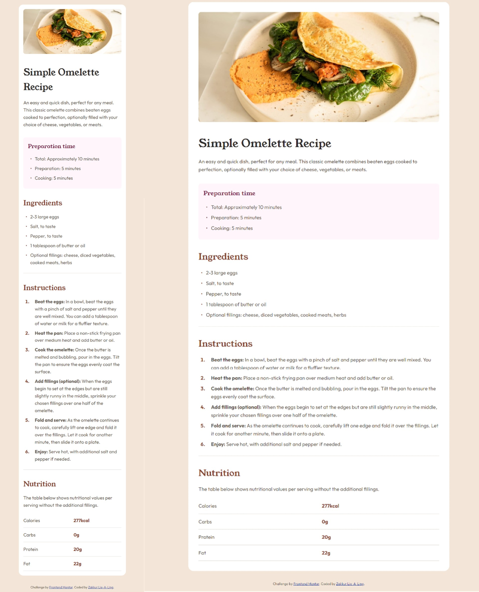

# Frontend Mentor - Recipe Page Solution

This is my solution to the [Recipe Page challenge on Frontend Mentor](https://www.frontendmentor.io/challenges/recipe-page-KiTsR8QQKm). Frontend Mentor challenges help you improve your coding skills by building realistic projects.

## Table of Contents

- [Overview](#overview)
  - [The Challenge](#the-challenge)
  - [Screenshot](#screenshot)
  - [Links](#links)
- [My Process](#my-process)
  - [Built With](#built-with)
  - [What I Learned](#what-i-learned)
  - [Useful Resources](#useful-resources)
- [Author](#author)

## Overview

### The Challenge

The challenge was to build a responsive recipe page for a "Simple Omelette Recipe" that matches the provided designs for mobile (375px) and desktop (1440px) layouts. The page includes sections for preparation time, ingredients, instructions, and nutritional information, styled to closely resemble the design files.

### Screenshot




### Links

- **Live Site URL**: [https://zakkur17.github.io/recipe-page-main/]
- **Solution URL**: [https://github.com/Zakkur17/recipe-page-main.git]

## My Process

### Built With

- Semantic HTML5 markup (e.g., `<main>`, `<section>`, `<ul>`, `<ol>`, `<table>`)
- CSS custom properties for colors and spacing
- Flexbox for layout and alignment
- Mobile-first workflow
- Google Fonts: Young Serif and Outfit

### What I Learned

This project helped me solidify several key skills:

- **Semantic HTML**: Using appropriate tags improved the structure and accessibility of the page. For example:
  ```html
  <section class="ingredients">
    <h2>Ingredients</h2>
    <ul>
      <li>2-3 large eggs</li>
      <li>Salt, to taste</li>
    </ul>
  </section>

  Useful Resources
  - MDN Web Docs - Great reference for HTML semantics and CSS properties.
  - CSS Tricks - Flexbox Guide - Helped me master Flexbox for this layout.

  Author
 - Name: Zakkur Lie-A-Ling
 - Frontend Mentor: @Zakkur17
 - GitHub: @Zakkur17